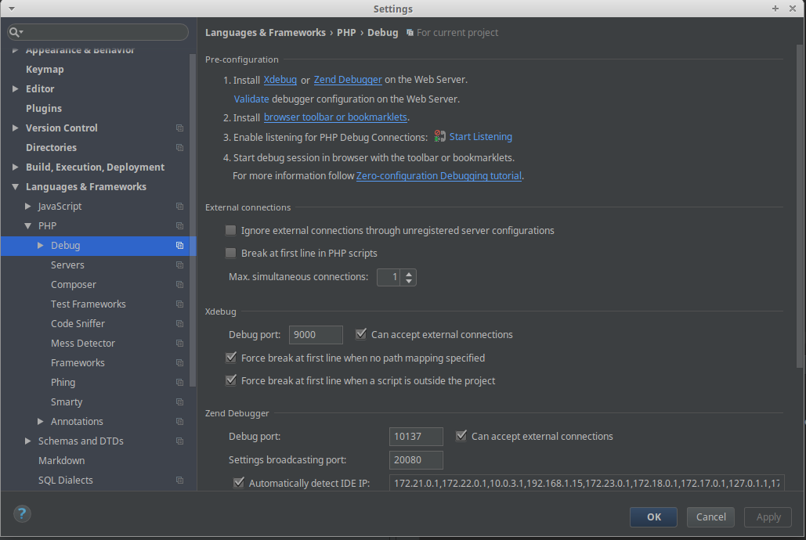
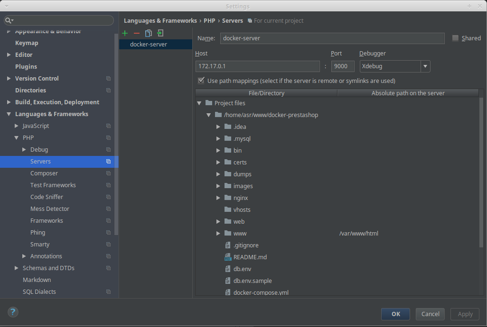
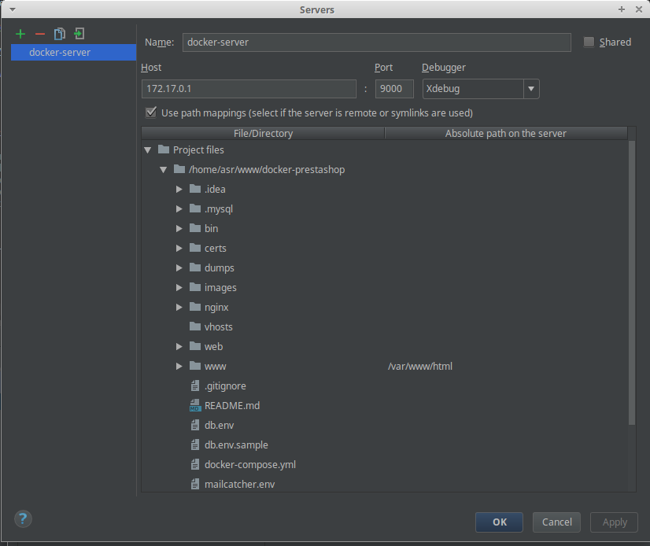
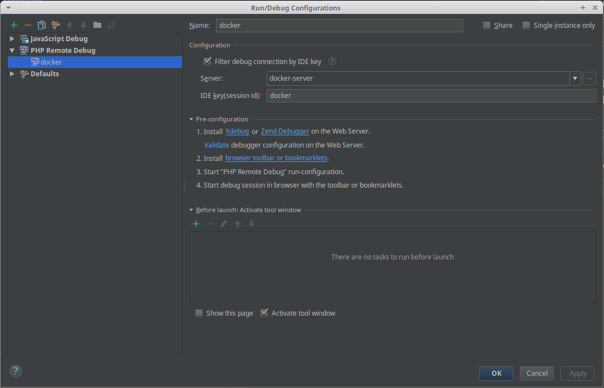

# Docker prestashop for development

This setup is my docker environment to run Prestashop instance for development purposes. This is done by running several containers:
* A prestashop container running PHP 7 and Apache
* A MySQL container used for the database
* A reverse proxy

## Requirement

This setup is running :
* docker version 18.06.1-ce
* docker-compose version 1.17.0

## Getting started

### Environment files

Create and adapt .env files based .env.sample 

If you need to import a database, place your dump inside of the `dumps` folder

### Generate SSL certificate

This docker environment is made to be run in HTTPS. Generate a self-signed certificate using the shell script in `bin/create-cert.sh`.

### Presatshop source

Place your prestashop sources inside of `www` folder

### Run containers
```
docker-compose up -d
```

## Scripts

In `bin/` folder, you can find useful scripts. The script are very straightfoward and mainly runs a single command. I store them here mainly to not forget them.
* `bash` : get a bash terminal inside of your container
* `mysql` : connect to mysql
* `db/export` : export your DB
* `db/import` : import your DB

## Configure xdebug

### Dockerfile

Check the IP address of your host and adapt it in the Docker file in the following line if needed
 
```
xdebug.remote_host=172.17.0.1
```

### PHPStorm

In `File > Settings`, open `Languages & Frameworks > PHP > Debug`, check that debug port is 9000 and `Can accept external connections` is checked.



In `File > Settings`, open `Languages & Frameworks > PHP > Servers`, add a server for XDebug as follow:



Add a debug configurations, `Run > Edit congifurations`. Used your host/port IP for Xdebug and map the `www` of your project to the path visible inside your container (`/var/www/html`).



Add a debug server as follow (the ide key is defined inside the Dockerfile.)

